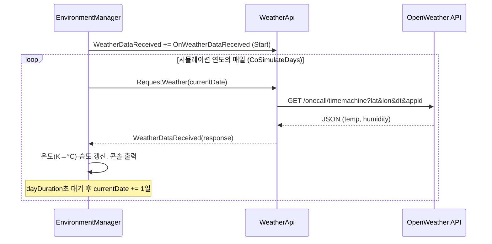

**경기 메타버스 해커톤(GMH 2024)_Healing Smart Farm 날씨 시뮬레이션 스크립트입니다.**

>**OpenWeather의 과거 날씨 데이터(timemachine API)를 기반으로, 하루를 짧은 주기로 재현합니다.**

+) 01_Scenes, 02_Scripts 폴더만 업로드하였습니다.

ref: [OpenWeather API](https://openweathermap.org/api)

---

### 1. 동작 방식
>- **과거 날씨 조회**: OpenWeather의 timemachine 엔드포인트로 특정 날짜·위치(위도/경도)의 온도와 습도를 가져온다.
>- **하루 단위 시뮬레이션**: 시뮬레이션 연도의 1월 1일부터 12월 31일까지, 하루를 `dayDuration`초 동안 흘려보내며 날짜를 하루씩 넘긴다.
>- **환경 갱신**: 받아 온 온도(°C)와 습도(%)를 `EnvironmentManager`가 보관하고 콘솔에 출력한다. SmartFarm의 외부 환경 변화를 재현하는 데 사용한다.

<br>

<div align="center">

</div>

<br>

### 2. 스크립트 구성 및 역할

```
Assets/
├── 01_Scenes/   WeatherAPI_Test.unity
└── 02_Scripts/  WeatherApi.cs, EnvironmentManager.cs
```

| 스크립트 | 구분 | 역할 |
|---|---|---|
| `WeatherApi.cs` | 매니저 (싱글톤) | OpenWeather timemachine API로 특정 날짜/위치의 과거 날씨를 받아 오고, 성공하면 `WeatherDataReceived` 이벤트로 알린다. 응답 구조체(`WeatherResponse`, `WeatherInfo`)도 함께 정의한다. |
| `EnvironmentManager.cs` | 매니저 (싱글톤) | 하루 단위로 날씨를 요청하고, 하루를 `dayDuration`초로 흘려보내며 현재 날짜·온도·습도를 갱신한다. |

<br>

#### - 런타임 흐름



<br>

#### - 주요 멤버

**`WeatherApi.cs`**
| 멤버 | 설명 |
|---|---|
| `Instance` | 싱글톤 인스턴스 |
| `apiKey`, `remainingApiCalls` | API 키, 남은 호출 횟수 (인스펙터). 호출 횟수는 무료 플랜 한도 보호용 안전장치 |
| `latitude`, `longitude` | 조회 위치 (인스펙터) |
| `WeatherDataReceived` | 날씨 데이터를 성공적으로 받았을 때 발생하는 이벤트 |
| `LatestWeather` | 마지막으로 받은 응답 |
| `RequestWeather(DateTime)` | 해당 날짜의 날씨를 비동기로 요청 (`CoRequestWeather` 코루틴) |
| `KelvinToCelsius()` | 켈빈 → 섭씨 변환 |

**`EnvironmentManager.cs`**
| 멤버 | 설명 |
|---|---|
| `Instance` | 싱글톤 인스턴스 |
| `simulationYear`, `dayDuration` | 재현할 연도, 하루가 실제로 흐르는 시간(초) (인스펙터) |
| `CurrentDate`, `Temperature`, `Humidity` | 현재 시뮬레이션 날짜, 온도(°C), 습도(%) (읽기 전용) |
| `CoSimulateDays()` | 코루틴: 날씨 요청 → 수신 대기 → `dayDuration`초 대기 → 다음 날 |
| `OnWeatherDataReceived()` | `WeatherDataReceived` 이벤트 핸들러. 온도·습도를 갱신하고 대기 중인 코루틴을 깨운다 |

<br>

### 3. 사용 방법
1. 씬에 `WeatherApi`와 `EnvironmentManager` 컴포넌트를 각각 하나씩 둔다. (`01_Scenes/WeatherAPI_Test.unity` 참고)
2. `WeatherApi` 인스펙터에 OpenWeather **API 키**를 입력한다. (One Call API 3.0 구독 필요, 키는 저장소에 올리지 않는다)
3. 위도/경도, 시뮬레이션 연도, 하루 길이를 필요에 맞게 조정하고 실행하면 콘솔에 날짜별 온도·습도가 출력된다.
